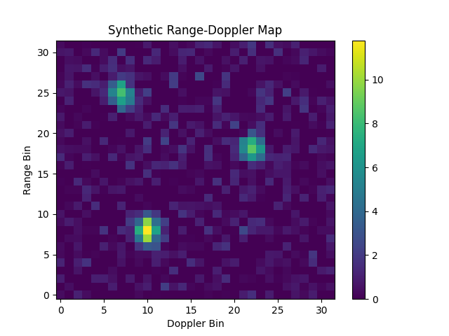

# Embedded Radar Signal Processing

A compact C++ demo of a simplified radar processing pipeline for automotive and embedded sensing applications.

## Features
- Synthetic range-Doppler map generation
- CFAR-like adaptive peak detection
- Target list extraction
- CSV export for visualization
- Python heatmap plotting
- CMake-based build setup

## Technical Notes
- Synthetic targets are injected into a 2D range-Doppler map as Gaussian blobs.
- A local-noise estimate is used to form a CFAR-like adaptive threshold.
- Local-max filtering is applied before reporting detections.
- The implementation is intentionally simplified for demonstration and portfolio purposes.

## Project Structure
- `include/` : radar pipeline interface
- `src/` : implementation and executable entry point
- `python/` : visualization script

## Build on Windows (Visual Studio)
Open the folder in Visual Studio as a CMake project and build the `radar_demo` target.

## Build on Linux / command line
```bash
mkdir build
cd build
cmake ..
make
./radar_demo
```

## Output

The program generates:

- console-based ASCII range-Doppler visualization

- detected target list

- rd_map.csv for plotting


## Example Detection Pipeline

Synthetic targets → Range-Doppler map → CFAR-like detection → Target list


## Example Visualization




## Background

This project demonstrates radar-processing fundamentals relevant to embedded and automotive sensing systems. It was created as a compact C++ implementation to complement earlier MATLAB-based radar target generation and detection work.

## Future Work
- Add GoogleTest-based unit tests
- Refactor detector parameters into a config structure
- Support CSV path as a command-line argument
- Extend from detection to simple target tracking
